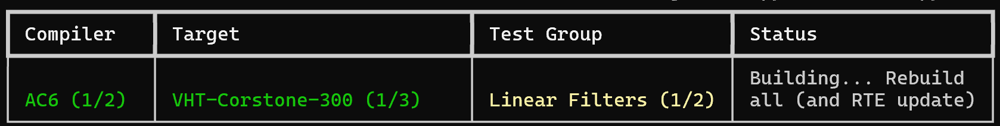

# README

## Introduction

The goal of the test framework included in this folder is to run regression of all the CMSIS-CV kernels with different cores (M4, M55) and different compilers (AC6,GCC) on FVP. clang not yet supported because of issues with semi-hosting in input mode (issues that may not be clang related).

The framework is relying on the CMSIS build tools for building with different compilers.

To run a regression for the first time:

```shell
python runall.py --gen
```

The summary is generated in `summary.html` and will list all errors if any (build error, test failure ...)

The live status will display the last failing groups:



### Option details

#### `-avh` AVH folder

Where to find the FVP executable. By default it is the uVision folder on Windows.

#### `-d` Debug log for command launch

Display commands that are executed to debug potential problems (FVP not launched etc ...)

#### `-n` No force rebuild

First build of a group will fully rebuild (regenerate cmake) and regenerate RTE.

It is important when the build is switching between compilers of targets.

If you debug and test only with one compiler / target, you may want to disable it to have faster rebuild.

#### `--gen` Generate inputs and references

First time there are no input images or reference patterns. They need to be generated.

#### `--results` Generate test result images

Results (in .dat file) may be converted to images or `.npy` files and recorded in specific folders. It can be useful for debug. Otherwise, the system is just validating the test but not recording the result.

#### `--dev` Kernel development mode

In development mode, only the development kernel is used.

#### `--norun` Don't run the FVP

Don't run. Can be useful to generate an `.axf` or `.elf` and the corresponding input file and then  use this without this test script to debug.

Once it is done, it is possible to rebuild this `.axf`/`.elf` using `cbuild` without having to re-run this script.

Useful for preparing an executable for debug or to run on board.

#### `--group` Select a test group

Only build / run the specified test group

#### `--test` Select a specific test

Only the selected test in the selected group will be run.

Useful for debug when you want to rebuild/rerun only a specific test.

### Customizing `runall.py` compiler and targets

`configFiles` variable is describing the config files required to run each FVP.

`avhExe` name of the executable to run for each FVP (windows name. You need to change it to run on Linux)

`compiler` : Structure describing the compiler / target configuration that must be built / run.

Note that for `gcc` the link script for M4 and M7 have not yet been updated

## Test descriptions

### The file `test_dec.py`

#### `allSuites` : Descriptions of all the tests

This is a list of test group. Each list item describe a test group and a list of tests in this group.

The test group is defined with

```python
        "name" : "Linear Filters",
        "define": "TESTGROUP1",
        "inputs": [Image([(16,16)
                         ,(32,32)],
                   format=Format.GRAY8,
                   path="Patterns/Mandrill.tiff"),
                   Image([(16,16)
                         ,(32,32)],
                   format=Format.RGB,
                   path="Patterns/Mandrill.tiff")],
        "tests":[]
```

`name` : name used in the test report to display the status

`define` : Compilation define used to compile only a specific test group

`inputs` : Set of images available to all of the test of this test group.

`tests`: List of tests in this test group.

Each test in this list has format:

```python
{"desc":"Copy gray8 image 16x16",
"funcid": 1,
"useimg": [0],
"reference": CopyInput(),
"check" : IdenticalImage()
}
```

`desc` : Title for test report

`funcid`: Function to run for this test. (Starting at ID = 0 in the test group)

`useimg` : Images used as input of this test. The index (starting at zero) are indexes in the image set for the test group containing this test. It is only used on the Python side to be bale to compute if the test has passed or failed. The Python needs the test input to generate the reference test patterns.

`reference`: Python object used to generate the reference pattern for this test. When it is called, it will receive all image inputs.

`check`: Python object used to validate if the test has passed or not. When it is called it receive the reference and output images for the test

#### `devTest` : Description of development

When you develop a new test, you can use the test mode where a shorter description can be used:

```python
devTest = {
        "inputs": [Image([(16,16)],
                   format=Format.GRAY8,
                   path="Patterns/Mandrill.tiff")],
        "reference": CopyInput(),
        "check" : IdenticalImage()
}
```


### Test input generation

The `inputs` field receive Python object that knows how to generate a list of image or tensors. Those list are then concatenate din the to make the final set of images for the test group.

#### Image

```Python
def __init__(self,dims,format=Format.GRAY8,path=None):
```

It is an image generators that can generate several sized images from an image on disk.

`dims` is a list of dimensions.

For instance,

``` python
Image([(16,16)
      ,(32,32)],
      format=Format.GRAY8,
      path="Patterns/Mandrill.tiff")
```

The `Image`object generates two images of size (16,16) and (32,32) in gray. The images are resized from the pattern image `Mandrill.tiff`.

In case the format is neither `gray8` or `rgb888` then the image has to be exported as a general NumPy tensor using `GenTensor`

```python
def __init__(self,a,b,c,the_type)
```


The 3 dimensions are passed followed by the NumPy type.

The framework support tensors of 1 to 4 dimensions but as an example we only provided a Python class to generate tensors of 3 dimensions. It should not be difficult to build variant of this class.

### Reference pattern generation

When input images have been generated, reference patterns must be generated : the output of the test.

In the example we only provided an object that is making a copy of the list of input (the list of input to the test that is different from the list of images in the test group. Most often this list of images will contain only one image.)

```python
def __call__(self,args,group_id,test_id,srcs):
```

The reference object is called to generate reference patterns. The arguments of the call are:

`args` : argument passed to the script

`group_id` being run

`test_id` being run

`srcs` : List of input images

`args`,`group_id` and `test_id` are used to record the reference image on disk.

For instance, the function is using:

```python
for image_id,img in enumerate(srcs):
            record_reference_img(args,group_id,test_id,image_id,img)
```

Generally when you create a reference image, you need to use this record_reference_omg to record thr image.

You need an `image_id` and an `img` argument.

Import and export is done thought the class `AlgoImage` defined in `export.py`

This class can either contain a `Pillow` image or a Numpy tensor. It is the class you get when reading a reference or input image from disk or when you save an image / tensor to disk or when you create an input image or tensor.

### Test validation

The validation function is called with:

```python
def __call__(self,ref,result):
```

It receives a list of inputs and a list of references.

The images are of `AlgoImage` type.

Two examples are provided:

`IdenticalTensor` and `IdenticalImage`

## Writing a test group in C

A test group is implemented as a switch case to run different function depending on the function id:

```CPP
void run_test(const unsigned char* inputs,
              const uint32_t testid,
              const uint32_t funcid,
              unsigned char* &wbuf,
              uint32_t &total_bytes)
{

    wbuf = nullptr;
    switch(funcid)
    {
        case 0:
            test_rgb(inputs,wbuf,total_bytes,testid);
            break;
        case 1:
            test_gray8(inputs,wbuf,total_bytes,testid);
            break;
    }

}
```

`wbuf` is the write buffer where the set of output images for this test is written.

Each test is receiving the `testid` that can be used to identify what are the images from the imageset to use as input of the test.,

Let's look at `test_gray8` to understand the details:

```CPP
void test_gray8(const unsigned char* inputs,
                unsigned char* &outputs,
                uint32_t &total_bytes,
                uint32_t testid)
{
    uint32_t nb_dims,dim0,dim1,dim2,dim3;;
    int bufid = TENSOR_START + 0;
    if (testid == 1)
        bufid = TENSOR_START + 1 ;
```

`inputs` is the set of images available to the tests. Each buffer in this set can be accessed through the APIs provided by `common.h` and `load.hpp`.

`outputs` and `total_bytes` are used to return the set of output images.

In the input set, some buffers are used for the test description. The images and tensors that can be used for the tests only start at `TENSOR_START`.

According to the `testid`, the test is defining which image to use in the input test set.

Then we get the tensor dimensions of the input tensor:

```CPP
get_buffer_shape(inputs,bufid,&nb_dims,&dim0,&dim1,&dim2,&dim3);
```

If the input tensor is an image, there is an API to get the width and height.

Then we describe the format of images and tensors in the output of this tests (the output is a set of images / tensors)

```CPP
std::vector<BufferDescription> desc = {BufferDescription(Shape(dim0,dim1)
                                                              ,kIMG_GRAY8_TYPE)
                                       };
```

In this example, we define an output image (two dimensions) with same width and height as input and using gray8.

Note that `dim0`, `dim1`, `dim2` would generally correspond to `height`, `width`,`channels` ...

Once the output has been described, we create a buffer for the output set:

```CPP
outputs = create_write_buffer(desc,total_bytes);
```

Now we access the input image in the input set and the output image in the output set:

```CPP
const uint8_t *src = Buffer<uint8_t>::read(inputs,bufid);
uint8_t *dst = Buffer<uint8_t>::write(outputs,0);
```

We finally copy the input onto the output:

```CPP
 memcpy(dst,src,get_buffer_length(inputs,bufid));
```

